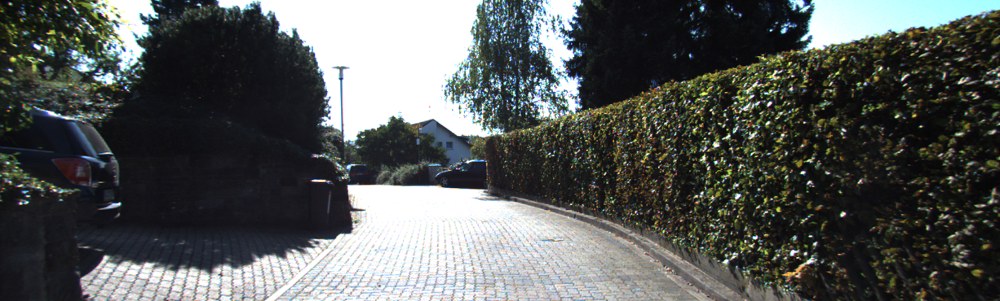
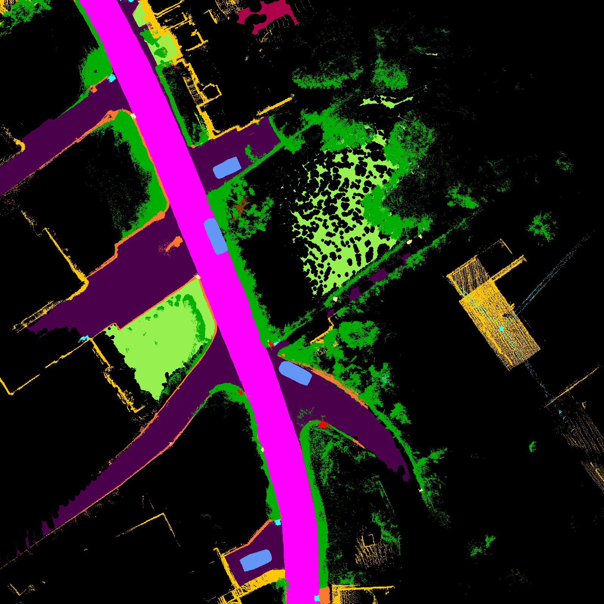
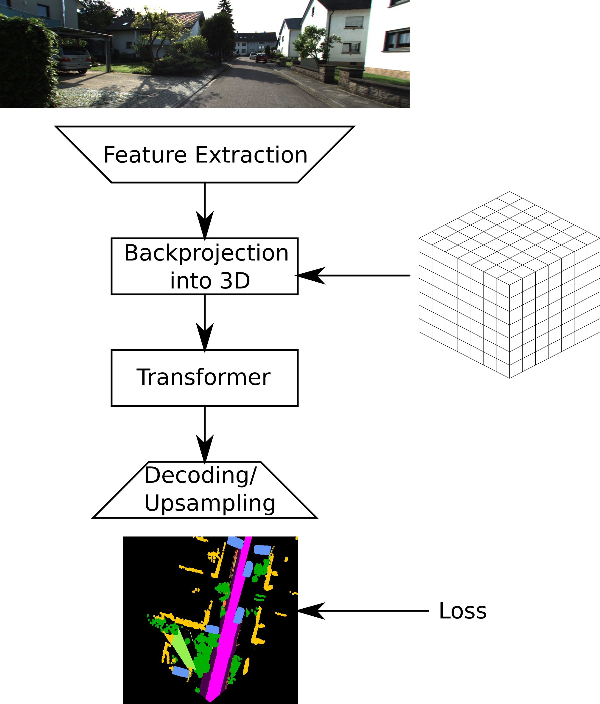
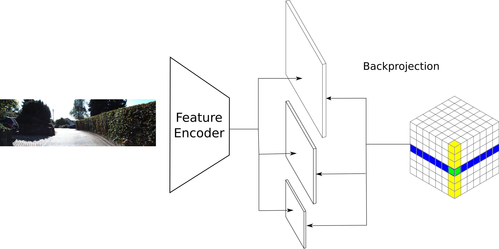
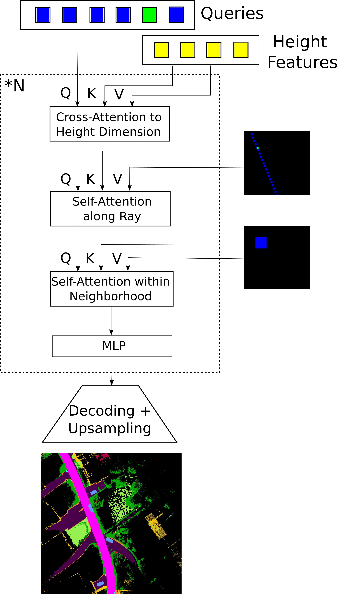
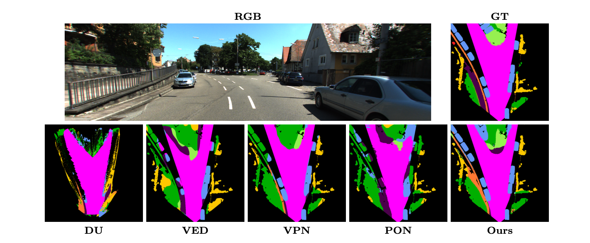
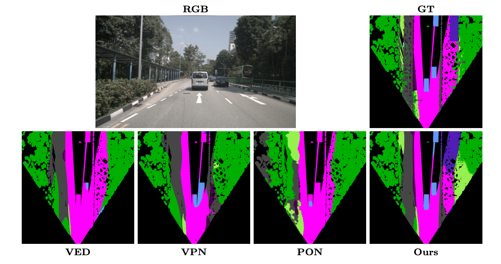

# BEVTransformer

## Overview

BEVTransformer is an end-to-end transformer architecture translating monocular street scene imagery into a segmented Bird's-Eye-View representation using PyTorch Lightning.

<table align="center">
  <tr>
    <td align="center" valign="middle"></td>
    <td align="center" valign="middle" style="font-size:64px; padding: 0 24px;">&#8594;</td>
    <td align="center" valign="middle"></td>
  </tr>
</table>

## Architecture

The basic architecture comprises a generic feature extractor, the incorporation of 3D geometric features, a custom-tailored transformer that attends to these features and an upsampling stage.
For the feature extractor Swin Transformer (Liu et al., 2021) is used. Any other generic extractor can be plugged into the architecture.

<p align="center">
  
</p>

The geometric feature extraction works as follows. A voxel grid extending the ground plane along the height dimension is constructed. These voxels are "splatted" onto the feature volumes of different scalings. Afterward the voxels are populated with the interpolated mean value over all volumes. We call this process "Backprojection".

<p align="center">
  
</p>

The custom-tailored transformer consists of 3 modules, each one attending to different elements of the extracted geometric features. The first one performs attention along the height dimension, the second one along a ray from the origin of the coordinate system through the point projected onto the ground plane and the third one within the neighbourhood. Normalization is performed after each step and a Multi-Layer-Perceptron concludes a Transformer layer. The total amount of consecutive transformer layers can be adapted for training.

<p align="center">
  
</p>

## Results

For training and evaluation KITTI-360 PanopticBEV and nuScenes PanopticBEV was used (Gosala et al., 2022). Our model is compared against baselines based on Intersection over Union (IoU) as a performance metric. It achieves higher results in terms of mean IoU and for most of the individual classes.

### nuScenes PanopticBEV

| Method | Road | Sidewalk | Manmade | Vegetation | Terrain | Person | Car | Truck | Rider | Mean |
|--------|------|----------|---------|------------|---------|--------|-----|-------|-------|------|
| VED    | 76.2 | 21.2     | 34.5    | 37.9       | 27.0    | 0.0    | 25.0 | 14.2 | 0.0   | 26.2 |
| VPN    | 75.9 | 22.4     | 38.0    | 34.0       | 29.7    | 0.5    | 34.9 | 18.7 | 0.1   | 28.3 |
| PON    | 68.2 | 12.6     | 31.8    | 29.9       | 23.0    | 0.0    | 14.7 | 7.2  | 0.0   | 20.8 |
| PON*   | 74.1 | 23.3     | 31.6    | 34.4       | 29.0    | 2.9    | 32.2 | 27.6 | 5.6   | 29.0 |
| PBEV*  | 77.3 | 28.6     | 36.7    | 35.1       | 33.6    | **5.0**| 40.5 | 33.5 | 9.6   | 33.3 |
| **BEVT** | **82.3** | **33.3** | **44.3** | **42.7** | **40.1** | 1.0 | **52.0** | **46.6** | **10.1** | **39.2** |

*IoU results on the validation split of nuScenes PanopticBEV. The upper part summarizes baselines from the literature. BEVT is our BEVTransformer architecture. Best results per class are highlighted in bold.*

### KITTI-360 PanopticBEV

| Method | Road | Sidewalk | Building | Wall | Vegetation | Terrain | Person | Rider | Car | Truck | Mean |
|--------|------|----------|----------|------|------------|---------|--------|-------|-----|-------|------|
| VED    | 67.4 | 27.8     | 28.6     | 2.9  | 45.3       | 19.2    | 0.0    | 0.0   | 23.9 | 1.3  | 21.6 |
| VPN    | 75.4 | 35.9     | 30.5     | 7.8  | 47.8       | 25.6    | 0.0    | 0.2   | 41.2 | 9.3  | 27.4 |
| PON    | 65.4 | 26.2     | 25.5     | 1.9  | 38.8       | 12.9    | 0.0    | 0.0   | 25.1 | 0.9  | 19.7 |
| PON*   | 73.4 | 34.0     | 27.6     | 9.1  | 36.8       | 33.0    | 1.6    | 3.0   | 37.0 | 14.5 | 27.0 |
| PBEV*  | 75.5 | 40.1     | 28.7     | **16.4** | 40.9   | 35.6    | **4.8**| 8.5   | 42.5 | 15.3 | 30.8 |
| **BEVT** | **77.6** | **40.5** | **44.1** | 13.8 | **58.7** | **41.5** | 0.0 | **8.7** | **56.7** | **16.1** | **35.8** |

*IoU results on the validation split of KITTI-360 PanopticBEV. The upper part summarizes baselines from the literature. BEVT is our BEVTransformer architecture. Best results per class are highlighted in bold.*

Baselines: VED (Lu et al., 2019), VPN (Pan et al., 2020), Pyramid Occupancy Networks / PON (Roddick and Cipolla, 2020) and PanopticBEV / PBEV (Gosala et al., 2022). The asterisk indicates that slightly differing ground plane dimensions were used for evaluation and training as described in Gosala et al., 2022. Direct comparability is not given, results are shown for reference and completeness. A retraining of PBEV on modified dimensions was not possible due to lack of computational resources.

## Qualitative Results

Qualitative analysis shows significantly better detection rates for occluded and small objects and those distant from the camera. Also, object contours are detected more precisely.

<p align="center">
  
</p>

<p align="center">
  
</p>

## How to use

### Setup

The project uses PyTorch Lightning with a Conda environment. Create it from `requirements.yml`:

```bash
conda env create -f requirements.yml
conda activate BEVTransformer1.6
```

Download a Swin-Transformer checkpoint (e.g. `mask_rcnn_swin_tiny_patch4_window7.pth`) or any other generic feature extractor and place it in a `pretrained/` directory. Its filename is referenced as `snapshot` in the model configs.

### Configuration

Paths to datasets, label directories, pretrained weights and the log directory are defined once in `configs/meta_config.yaml` and merged into every experiment config at startup. Adjust these to your local paths before running anything. Supported datasets are KITTI-360 PanopticBEV and nuScenes PanopticBEV.

Individual experiments are configured via YAML files in `configs/`, specifying the model (backbone, 3D feature extractor, transformer, decoder, loss) and the data module (dataset, batch size, augmentations). Existing configs cover the main model, ablations (e.g. disabling ray/neighbourhood/height attention) and dataset variants.

### Training

```bash
python main.py --name <run_name> --base configs/<config>.yaml -t True --gpus 0,
```

Ready-to-use SLURM job scripts for common configurations are provided in `scripts/`. Training is resumable and autoresumes by default from the last checkpoint of a given `--name`.

### Evaluation

```bash
python evaluate.py --savename <run_name> --config configs/<config>.yaml --ckpt <path_to_checkpoint> --dataset {kitti360,nuscenes}
```

Add `--depth True` when evaluating a depth-conditioned model variant.
